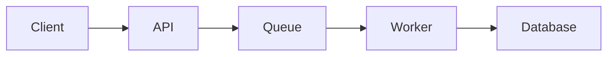

```md
# Lyra — Swipe Less. Read Better.

## Project Idea

Lyra is a mobile reading app designed to replace mindless short-form scrolling with high-quality technical and educational reading.

The core idea is simple:

> Take great long-form articles and blogs, compress them into highly readable, engaging formats, and present them through a frictionless swipe-based feed.

Instead of opening an Uber Engineering blog and facing a 20-minute article immediately, Lyra first shows an interesting, concise preview.

If the article catches your attention, swipe into it and read a condensed but substantive version of the original article.

The goal is **not to turn articles into shallow summaries**.

The goal is to transform long-form content into something closer to a great Reddit post, long Twitter/X thread, or beautifully structured technical explanation — while preserving the important ideas.

---

# Core Product Experience

## 1. Discovery Feed

When the user opens the app, they enter a vertical scrolling feed.

Each card contains:

- Article title
- Source
- Topic/category
- Short hook
- 2–4 sentence preview
- Estimated reading time

Example:

> ### How Uber Handles Millions of Events
>
> What happens when thousands of services are producing events simultaneously — and one part of the system goes down?
>
> Uber's architecture has some surprisingly elegant answers.
>
> **5 min read · Distributed Systems · Uber Engineering**

Swipe vertically → next article.

Swipe horizontally / tap → open the article.

---

# 2. Reader Experience

Opening an article enters a clean, distraction-free reader.

The original article is transformed into a condensed Markdown version.

Instead of:

**Original article → tiny AI summary**

the philosophy is:

**Original article → compressed high-quality article**

For example:

Original:

~20 minute technical blog

Lyra version:

~5–8 minute structured explanation

The transformed article should preserve:

- Core technical ideas
- Important examples
- Architecture decisions
- Tradeoffs
- Interesting implementation details
- Key numbers/statistics
- Lessons learned

While removing:

- Corporate fluff
- Repetition
- Excessive introductions
- Marketing language
- Unnecessary filler

---

# 3. Rich Technical Content

Articles are stored primarily as Markdown.

This allows content such as:

- Headings
- Lists
- Code blocks
- Quotes
- Tables
- Equations
- Diagrams

Technical diagrams can eventually be recreated using Mermaid.

Example:



Instead of storing every image from the original article, an AI transformation pipeline could recreate important architecture diagrams as Mermaid diagrams when appropriate.

---

# 4. Completion Instead of Bookmark Hoarding

Traditional reading apps encourage:

> Save for later.

Which often becomes:

> Save forever and never read it.

Lyra should emphasize **finishing**.

At the bottom of an article:

### ✓ Done

The app remembers:

- Articles opened
- Articles completed
- Articles liked
- Reading history

This creates a small sense of progression.

The product should reward **consumption of knowledge**, not accumulation of bookmarks.

---

# V1 — Personal Prototype

The first version should be intentionally tiny.

Goal:

> Build something I personally prefer opening instead of Reddit/X/Shorts.

Start with approximately **20 handpicked articles**.

Articles can initially be manually transformed using an AI model.

No automated ingestion pipeline is necessary.

### V1 Features

- Swift / SwiftUI iOS application
- Vertical article discovery feed
- Article preview cards
- Swipe/tap into article
- Markdown reader
- Mark article as Done
- Like article
- Basic reading history
- Categories/tags

No recommendation algorithm.

No complicated search.

No social features.

No automatic scraping.

---

# Architecture

## Client

**Swift + SwiftUI**

Responsible for:

- Feed UI
- Gestures
- Article rendering
- Markdown rendering
- Reader experience
- Local state
- Calling backend APIs

---

## Backend

**Supabase**

Supabase provides:

- Hosted PostgreSQL database
- API access
- Authentication
- Storage
- Row-level security
- Backend functionality

This avoids initially maintaining:

Client → Custom Backend → Database

Instead V1 can be:

Swift App
↓
Supabase
↓
PostgreSQL

A dedicated backend can be introduced later if the product requires more complex processing.

---

# Example Data Model

## articles

```text
id
title
source
original_url
hook
preview
content_markdown
category
tags
estimated_read_time
created_at
```

## user_article_state

```text
user_id
article_id
opened
completed
liked
reading_progress
completed_at
```

This user interaction data eventually becomes useful for recommendations.

---

# Future — Automated Content Pipeline

Eventually the ingestion process could become:

Original Blog
↓
Content Extraction
↓
LLM Transformation
↓
Fact / Structure Validation
↓
Markdown Generation
↓
Mermaid Diagram Generation
↓
Supabase
↓
Lyra Feed

The transformation prompt would specifically optimize for:

**"Make this feel like an excellent technical Reddit post or long-form thread, not an AI summary."**

---

# V2 — Recommendations

Once enough content and interaction data exists, Lyra could start learning what the user enjoys.

Signals could include:

- Article opened
- Article completed
- Article abandoned
- Like
- Reading time
- Categories
- Authors/sources
- Topics

Then build:

> "What should this person read next?"

Initially this could be simple rule-based ranking.

Later:

- Embeddings
- Content similarity
- Collaborative filtering
- Personalized ranking
- Exploration vs exploitation

---

# V3 — Semantic Search

Once hundreds/thousands of articles exist, traditional keyword search becomes less interesting.

Instead, allow searches like:

> "How do companies handle failures in distributed systems?"

or

> "Show me interesting approaches to reducing LLM inference cost."

The system could perform semantic retrieval across the article corpus.

Possible architecture:

Query
↓
Embedding
↓
Vector Search
↓
Candidate Articles
↓
Ranking
↓
Results

---

# V4 — Discovery

Eventually Lyra could contain different discovery modes:

### For You
Personalized recommendations.

### Following
Specific blogs/authors/companies.

### Topics
AI, distributed systems, databases, science, history, etc.

### Surprise Me
Deliberately surface something outside the user's normal interests.

This prevents the recommendation system from becoming an intellectual filter bubble.

---

# Potential Sources

Initially:

- Uber Engineering
- Netflix Tech Blog
- Cloudflare Blog
- Stripe Engineering
- Discord Engineering
- OpenAI research/engineering posts
- Anthropic research
- Meta Engineering
- Google Research
- Interesting personal engineering blogs
- Research papers
- High-quality essays

Eventually the system shouldn't be limited to engineering.

It could contain:

- Science
- History
- Economics
- Psychology
- Space
- Philosophy
- AI
- Programming
- Interesting essays

---

# Product Philosophy

Lyra should borrow the **interaction mechanics of addictive apps without copying their incentives**.

TikTok optimizes:

> Keep scrolling.

Lyra should optimize:

> Find something interesting → actually understand it → finish it.

The feed creates curiosity.

The reader creates depth.

The **Done** button creates closure.

---

# North Star

The success metric for V1 is not users, revenue, downloads, or recommendation quality.

It's much simpler:

> "When I'm bored and instinctively reach for Reddit/X/Shorts, do I sometimes open Lyra instead?"

If 20 excellent articles are enough to make that happen, V1 worked.

Everything else can come later.
```